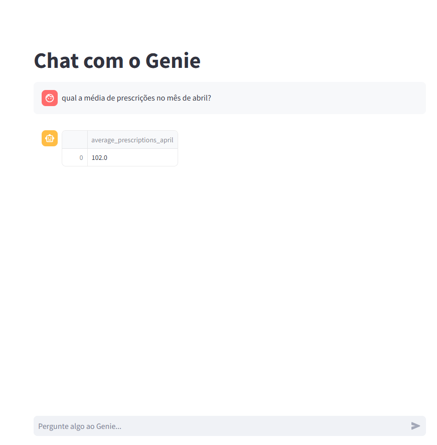

# Nossa experiência integrando o Genie ao Databricks App com Streamlit

Começamos o projeto criando um Databricks App com interface em Streamlit.  
Para isso, acessamos o menu lateral e fomos até Compute → Apps → Create App.  
Selecionamos o tipo Streamlit, marcamos a opção Data App, escolhemos o SQL Warehouse desejado e definimos um nome para a aplicação.

A criação leva alguns minutos para ser concluída, mas logo a aplicação fica pronta para edição e deploy diretamente no ambiente do Databricks.

---

## Treinando o Genie

Com a base de dados carregada, treinamos o Genie para que ele reconhecesse os dados e pudesse respondê-los via linguagem natural.

---

## O desafio da integração

Nosso maior desafio foi: como conectar o Genie ao app de forma interativa?

Após bastante pesquisa e tentativa, encontramos o repositório do [@datasciencemonkey](https://github.com/datasciencemonkey), que nos ajudou a entender como a integração via API funciona.

---

## O que aprendemos

A partir da estrutura dele, conseguimos:

- Entender como capturar e utilizar o `space_id`
- Iniciar uma `conversation_id`
- Enviar e receber mensagens com `message_id`
- Configurar corretamente o `DATABRICKS_HOST` e o token pessoal (PAT)
- Exibir respostas do Genie de forma dinâmica na tela

A aplicação final, construída como um Databricks App com Streamlit, já conseguia interagir com o Genie de forma fluida.  
Abaixo está uma captura de como ficou a interface funcionando:

---

## Aspectos técnicos da implementação

Alguns aspectos técnicos que exploramos ao longo do projeto incluem:

- **Controle de conversas com o Genie:** utilizamos as APIs públicas para iniciar conversas e acompanhar o status das respostas usando `conversation_id` e `message_id`.
- **Tratamento de respostas estruturadas:** o app foi preparado para lidar tanto com respostas em texto quanto com anexos retornados pelo Genie (como tabelas), exibindo os dados diretamente no Streamlit.
- **Interface interativa e com histórico:** a interface foi desenvolvida com `st.chat_message` e `st.session_state`, permitindo manter um histórico de interações entre o usuário e o Genie.
- **Gerenciamento de erros e tempo de resposta:** implementamos controle de exceções e timeout para garantir uma experiência estável e responsiva mesmo em caso de falhas ou lentidão da API.

---

Essa foi uma ótima oportunidade para entender melhor como funcionam os Databricks Apps, o SDK e a estrutura da API do Genie. Registramos aqui como referência e para ajudar outros que estejam explorando esse tipo de integração.
